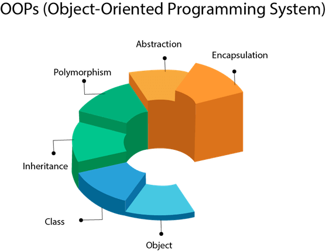

# 16 — Classes, Objects & Data Structures



Foundations of C++ classes and objects, finishing with four classic data structures
implemented as OOP exercises.

## Examples

| # | Topic |
|---|-------|
| 01 | Classes and objects |
| 02 | Constructors |
| 03 | Defaulted constructors |
| 04 | Setters and getters |
| 05 | A class split across multiple files (`.h`/`.cpp`) |
| 06 | Arrow (`->`) pointer call notation |
| 07 | Destructors |
| 08 | Order of constructor/destructor calls |
| 09 | The `this` pointer |
| 10 | `struct` |

## Homework

| # | Exercise |
|---|----------|
| 01 | Library management system |
| 02 | Employee management system |
| 03 | Bank account with encapsulation |
| 04 | Employee class with setters/getters |
| 05 | Online shop system (multi-file: `Product` + `Order`) |
| 06 | Library system, applying OOP principles |
| 07 | Bank account basics |
| 08 | Bank + Account classes |
| 09 | Method chaining with pointers (`MathOperations`) |
| 10 | Method chaining with references (`MathOperations`) |
| 11 | Student/Classroom (`struct`) |
| 12 | Linked list |
| 13 | Stack |
| 14 | Queue |
| 15 | Binary search tree |

> **Note:** `homework-13-stack.cpp` includes a `LinkedList.h` that isn't in this folder — the
> instructor still needs to add it (or clarify that students should reuse their own homework 12
> linked list) before this exercise will compile.

## Build & run

```sh
cd examples/05-class-across-multiple-files
g++ -std=c++17 -Wall -o main main.cpp
./main
```
