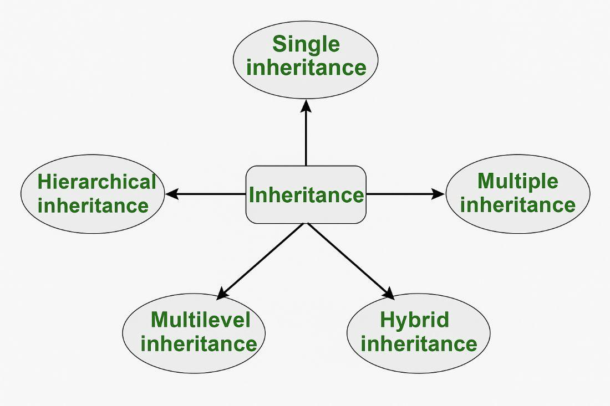
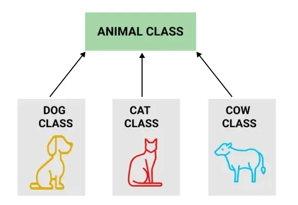
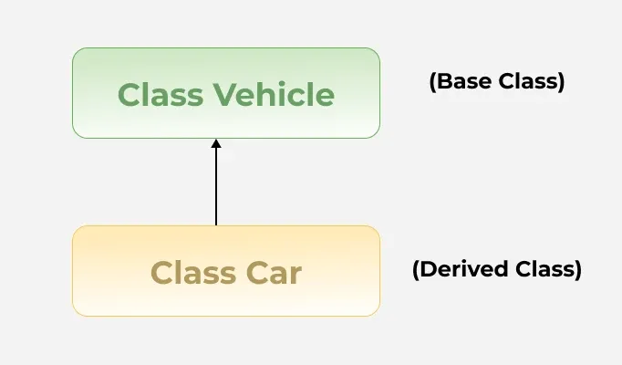
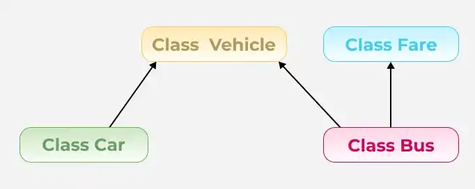

# 17 — Inheritance



Base/derived classes, access control across inheritance, and how constructors/destructors
behave in a hierarchy.

<table>
<tr>
<td></td>
<td></td>
<td></td>
</tr>
</table>

## Examples

| # | Topic |
|---|-------|
| 01 | Introduction to inheritance |
| 02 | Protected members |
| 03 | Access specifiers |
| 04 | Private inheritance |
| 05 | Default constructors with inheritance |
| 06 | Custom constructors with inheritance |
| 07 | Copy constructors with inheritance |
| 08 | Destructors with inheritance |
| 09 | Reused symbols in inheritance |

## Homework

| # | Exercise |
|---|----------|
| 01 | Protected members (`Person` / `Teacher`) |
| 02 | Library management system, using inheritance |
| 03 | Multiple inheritance |
| 04 | Choosing public/protected/private inheritance per scenario |
| 05 | Inheritance types in a banking application |
| 06 | Custom constructors with inheritance (`GameObject`) |

## Build & run

```sh
cd examples/05-default-constructors
g++ -std=c++17 -Wall -o main main.cpp
./main
```
