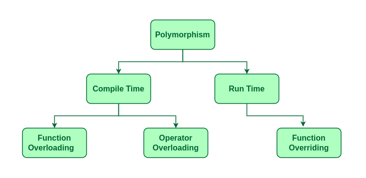
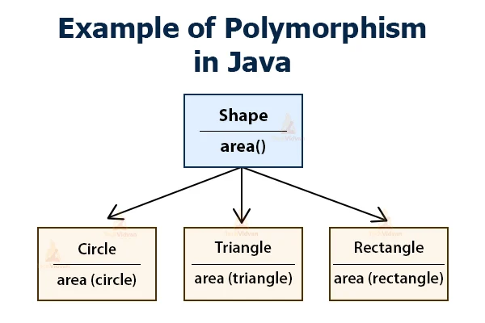
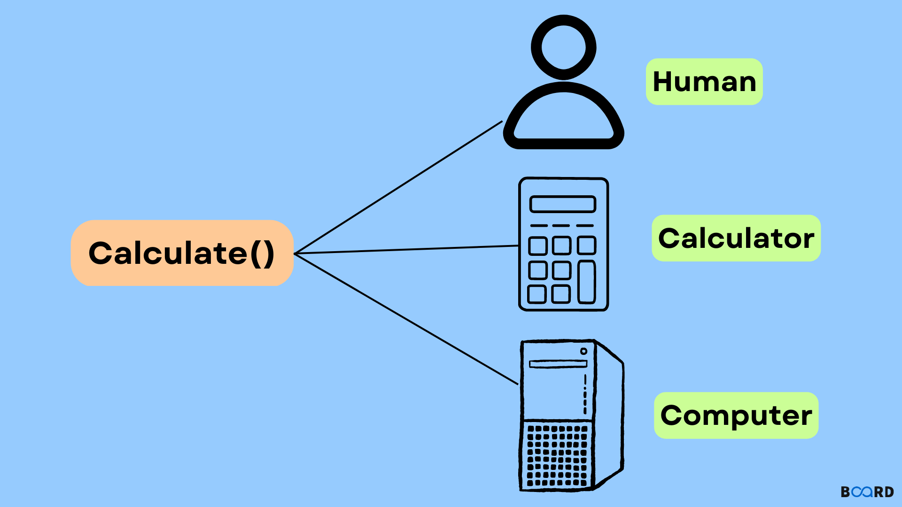

# 3 — Polymorphism



Virtual functions, dynamic vs. static binding, abstract classes/interfaces, and where
compile-time polymorphism (overloading) fits next to run-time polymorphism (overriding).

<table>
<tr>
<td></td>
<td></td>
</tr>
</table>

## Examples

| # | Topic |
|---|-------|
| 01 | Introduction to polymorphism |
| 02 | Static binding with inheritance |
| 03 | Dynamic binding with virtual functions |
| 04 | Object slicing |
| 05 | Polymorphic objects stored in a collection |
| 06 | `override` |
| 07 | Overloading vs. overriding vs. hiding |
| 08 | Virtual destructors |
| 09 | The `static` keyword |
| 10 | Inheritance and polymorphism at different levels (part 1) |
| 11 | Inheritance and polymorphism at different levels (part 2) |
| 12 | `final` |
| 13 | Polymorphic functions and destructors |
| 14 | Pure virtual functions and abstract classes |
| 15 | Abstract classes as interfaces |
| 16 | Compile-time vs. run-time polymorphism |
| 17 | What's next |

## Homework

| # | Exercise |
|---|----------|
| 01 | Shape hierarchy (`Circle`, `Rectangle`, `Triangle`, `Square`) |
| 02 | Library item hierarchy (books, e-books, audio CDs) |
| 03 | Theory question — which `Product` methods should be polymorphic? |
| 04 | Deciding which `Payment` methods should be virtual |
| 05 | Employee polymorphism (salary calculation) |
| 06 | Backend service hierarchy (overloading vs. hiding) |
| 07 | Banking system (`Account` hierarchy) |
| 08 | `static` keyword — stock price tracker |
| 09 | Static members — library late fees |
| 10 | Static members — shape area calculations |
| 11 | User hierarchy at different inheritance levels |
| 12 | `final` keyword — authenticator |
| 14 | Abstract `DataStorageProvider` |
| 15 | Abstract `PaymentMethod` provider |
| 16 | Backend data storage interface |
| 17 | Shape hierarchy as an interface |
| 18 | E-commerce system design |
| 19 | Compile-time vs. run-time polymorphism |

> Homework 13 doesn't exist in this set — the numbering follows the original course exercise
> numbers, and 13 was never assigned.

## Build & run

```sh
cd examples/03-dynamic-binding
g++ -std=c++17 -Wall -o main main.cpp
./main
```
