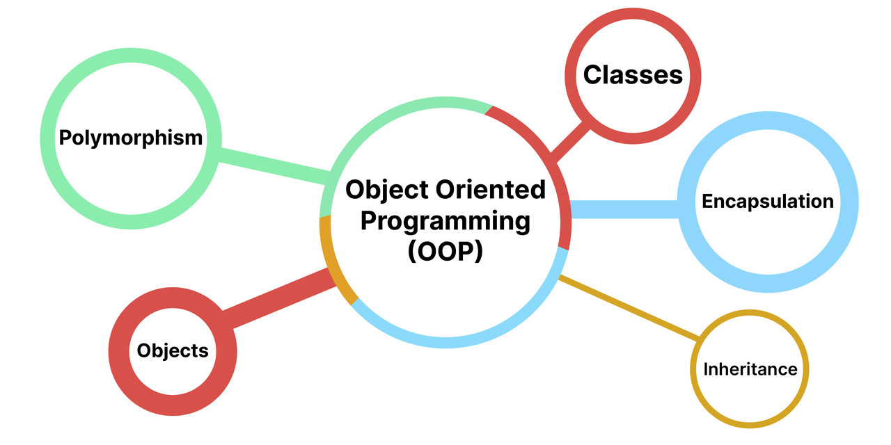

# C++ OOP — Examples & Exercises



A structured set of C++ object-oriented programming exercises, organized by topic. Each
numbered lesson folder contains worked **examples** you can read/run and a **homework** set
for students to complete. Written for a mixed audience — complete beginners through
experienced engineers brushing up on C++ specifics.

## Philosophy

**OOP is not something you memorize. It is something you deeply understand and learn to build with.**

This is a **complete theoretical and practical guide to Object-Oriented Programming** designed to take you from the basics to a deep, practical mastery of OOP — something most resources fail to provide.

Start from the fundamentals. Understand **why OOP exists, how its concepts actually work, and how to apply them in real software**. Then reinforce that understanding through practical implementations and increasingly complex problems.

### Why OOP?

OOP has a reputation for being difficult — not only for beginners, but even for experienced developers.

Many experienced developers jump straight into **Design Patterns** and **SOLID principles** without first developing a deep understanding of OOP itself. That often turns into memorizing rules instead of understanding the ideas behind them.

**Master OOP first, and Design Patterns and SOLID become much easier to understand.**

### OOP Is the Gateway to Real Projects

You can learn syntax without mastering OOP.

But sooner or later, serious software projects demand it.

**Backend. Frontend. Mobile. Game development. ML/AI. Large-scale systems.**

The tools and frameworks change. **The fundamental concepts don't.**

> **Don't just learn how to use OOP. Understand it deeply enough to design with it.**

**Learn the theory. Build the concepts. Practice the patterns. Master OOP.**

## Structure

```
1-CLASSES-OBJECTS-AND-DATA-STRUCTURES/   classes, objects, and 4 data structures (linked list, stack, queue, BST)
2-INHERITANCE/                           base/derived classes, access control, constructors & destructors
3-POLYMORPHISM/                          virtual functions, abstract classes, static/dynamic binding
```

Each lesson has its own `README.md` with a full topic list. The layout inside is the same
everywhere:

```
N-TOPIC-NAME/
├── README.md
├── images/                 # diagrams referenced at the top of this lesson's README.md
│   └── some-diagram.png
├── examples/
│   ├── 01-first-subtopic/
│   │   └── main.cpp        # supporting headers (person.h, ...) live alongside main.cpp
│   ├── 02-second-subtopic/
│   │   └── main.cpp
│   └── ...
├── homework/
│   ├── homework-01-short-description.cpp   # single-file exercise
│   ├── homework-02-short-description.cpp
│   └── ...
└── playground.cpp          # scratch file for experimenting, not part of the curriculum
```

- **`images/`** — reference diagrams shown at the top of the lesson's `README.md` for a quick
  visual overview before diving into the examples. Not every lesson needs one.
- **`examples/`** — instructor-provided code demonstrating one concept each, numbered in
  teaching order. Read these first, then attempt the homework.
- **`homework/`** — exercises for students, provided without solutions. Each file name hints
  at what the exercise is about (e.g. `homework-05-online-shop-system.cpp`).
- **`playground.cpp`** — a free scratch file per lesson for trying things out. Feel free to
  overwrite it locally; it's not graded content.

### Naming conventions

- The three top-level lesson folders are `N-UPPER-CASE-NAME` (`1-CLASSES-OBJECTS-AND-DATA-STRUCTURES`,
  `2-INHERITANCE`, `3-POLYMORPHISM`) so they stand out as the main sections of the guide at a glance.
  Everything inside a lesson (`examples/`, `homework/`, file names) stays `kebab-case`.
- Inside a lesson, numeric prefixes are zero-padded (`01`, `02`, … `10`) so they always sort correctly.
- Homework numbers follow the original exercise numbering — if a number is missing (e.g.
  lesson 3 has no homework 13), that exercise was never assigned; it isn't a mistake.
- A topic folder with a single source file names it `main.cpp`; multi-file topics keep the
  class name as the file name (e.g. `cylinder.h`, `Order.cpp`).
- Images in an `images/` folder are named for what they show, not their source
  (e.g. `inheritance-types-overview.jpg`, not `inheritance.jpg` or `IMG_0231.jpg`).

## Setup and Requirements

### What is Git?

Git is a version-control system — a time machine for your code. It lets you:

- Commit snapshots of your work.
- Revert to any earlier state.
- Experiment safely on branches.

### What is GitHub?

GitHub hosts Git repositories in the cloud and adds collaboration tools:

- Private/public storage for your code.
- Pull requests and code review.
- Issue tracking and an online portfolio.

### A C++ compiler

Any C++17-capable compiler works — GCC (`g++`), Clang, or MSVC. Examples below use `g++`.

- **macOS**: `xcode-select --install` (installs Clang/`g++` via Xcode Command Line Tools)
- **Windows**: install [MSYS2](https://www.msys2.org/) or the [MinGW-w64](https://www.mingw-w64.org/) toolchain, or use WSL with the Ubuntu instructions below
- **Ubuntu / Debian**: `sudo apt update && sudo apt install build-essential`

---

## Getting Started

### 1. Install Git

**macOS**

```bash
brew install git
```

**Windows**

1. Download Git for Windows: [https://git-scm.com/download/win](https://git-scm.com/download/win)
2. Run the installer and accept the defaults.
3. Verify installation:

```powershell
git --version
```

**Ubuntu / Debian**

```bash
sudo apt update
sudo apt install git
```

### 2. Initialize your Git identity (one-time)

Git stamps every commit with a name and email — set these once per machine:

```bash
git config --global user.name  "Your Name"
git config --global user.email "you@example.com"
```

### 3. Fork the repository

Click **Fork** on [github.com/rusterman/cpp-oop-examples-and-exercises](https://github.com/rusterman/cpp-oop-examples-and-exercises)
to create your own copy under your GitHub account. You'll work and commit inside your fork, not
the original.

### 4. Clone your fork (if you haven't already)

Replace `<your-username>` with your GitHub username:

```bash
git clone https://github.com/<your-username>/cpp-oop-examples-and-exercises.git
cd cpp-oop-examples-and-exercises
```

Optionally, add the original repo as `upstream` so you can pull in future updates:

```bash
git remote add upstream https://github.com/rusterman/cpp-oop-examples-and-exercises.git
git remote -v   # origin = your fork, upstream = original
```

### 5. Build and run an example

No build system is required — each example/homework compiles standalone:

```sh
cd 2-INHERITANCE/examples/02-protected-members
g++ -std=c++17 -Wall -o main main.cpp
./main
```

---

## How to Work Through This Guide

1. **Go in lesson order** — `1-CLASSES-OBJECTS-AND-DATA-STRUCTURES` → `2-INHERITANCE` →
   `3-POLYMORPHISM`. Each builds on the last.
2. **Read the lesson's `README.md` first** for the topic list and, where included, a diagram
   giving you the big picture before the code.
3. **Study every file in `examples/` in order**, numbered `01`, `02`, ... Read the code, run it,
   change something and re-run it — don't just read.
4. **Then work through `homework/` one exercise at a time**, in numeric order. Each file name
   hints at what it's testing (e.g. `homework-05-online-shop-system.cpp`).
5. **Don't modify anything under `examples/`.** Keep it untouched so you can always diff your
   solution against the original reference. Compiled binaries, IDE settings, and OS files
   (`.DS_Store`, `.idea/`, `.vscode/`, `*.exe`, extensionless build output, etc.) are already
   excluded via `.gitignore` — you shouldn't need to touch it.

## Submitting Your Homework

Use one branch per person, named after your GitHub username, so your solutions are easy to find
and never collide with anyone else's fork history:

| Step | Command |
|------|---------|
| Create your solution branch | `git checkout -b solutions/<your-username>` |
| Work locally, commit per exercise | `git add .`<br>`git commit -m "2: homework 03 - multiple inheritance"` |
| Push your branch to your fork | `git push -u origin solutions/<your-username>` |

Replace `<your-username>` with your actual GitHub username. Commit each homework exercise
separately with a clear message (`<lesson-number>: homework <NN> - <short description>`) so your
progress is easy to follow. Once pushed, you can open a pull request from
`solutions/<your-username>` into your own fork's `main` for a clean, reviewable diff of your work.
